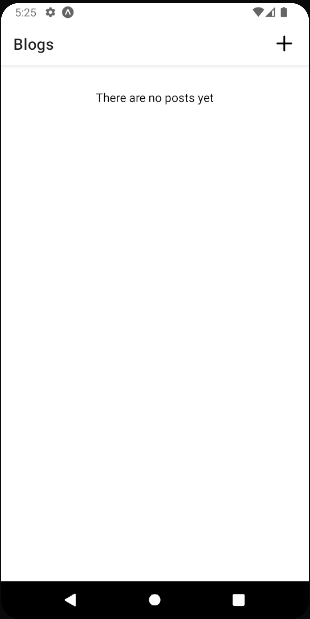

# Blog App

## React Native App with Context API

App that enable users to create and manage blog posts leveraging the power of React Native, Expo, hooks, useContext, and React Navigation.

### Key features
<ul>

  <li><h4>CRUD Operations</h4></li>
  
With the ability to Create, Read, Update, and Delete blog posts

   <li><h4>Blog Post Listing</h4></li>
  
The app provides a well-organized listing of blog posts, making it easy for readers.

   <li><h4>Context API and Hooks</h4></li>
  
The app utilizes React's Context API and hooks to efficiently manage and share data and application state, ensuring a responsive and smooth user experience.

    <li><h4>Navigation</h4></li>
  
The project employs React Navigation for easy navigation throughout the app, including stack navigation and different sections.

</ul>

### Demo

